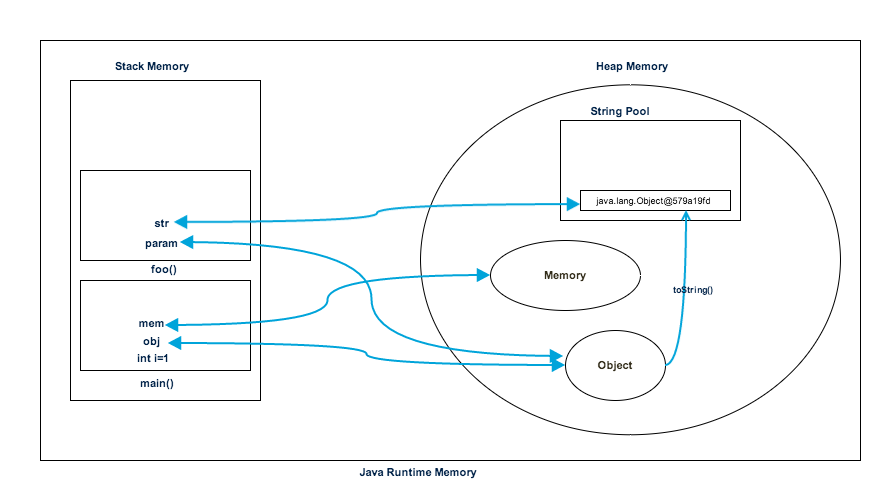

# Java (JVM) Memory Model - Memory Management in Java

## JVM Memory Model

JVM Heap Memory is divided into two parts - Young Generation and Old Generation.
Java Heap space is used by java runtime to allocate memory to Objects and JRE classes. 
Whenever we create an object, it’s always created in the Heap space. 
Garbage Collection runs on the heap memory to free the memory used by objects that don’t have any reference. Any object created in the heap space has global access and can be referenced from anywhere of the application.

## Memory Management in Java - Young Generation

- Young generation : Place where new objects are created.
- When young generation is filled, garbage collection is performed. This garbage collection is called Minor GC
- Young generation is divided into three parts - Eden Memory and two Survivor Memory spaces.
- Most of the newly created objects are located in the Eden memory space.
- When Eden space is filled with objects, Minor GC is performed and all the survivor objects are moved to one of the survivor spaces.
- Minor GC also checks the survivor objects and move them to the other survivor space. So at a time, one of the survivor space is always empty.
- Objects that are survived after many cycles of GC, are moved to the Old generation memory space. 
Usually, it’s done by setting a threshold for the age of the young generation objects before they become eligible to promote to Old generation.

## Memory Management in Java - Old Generation
- Old Generation memory contains the objects that are long-lived and survived after many rounds of Minor GC. 
- Usually, garbage collection is performed in Old Generation memory when it’s full. 
- Old Generation Garbage Collection is called Major GC and usually takes a longer time.

### Stop the world event
- All the Garbage Collections are “Stop the World” events because all application threads are stopped until the operation completes.
- Since Young generation keeps short-lived objects, Minor GC is very fast and the application doesn't get affected by this. However, 
Major GC takes a long time because it checks all the live objects.
- So if you have a responsive application and there are a lot of Major Garbage Collection happening, you will notice timeout errors. 
The duration taken by garbage collector depends on the strategy used for garbage collection.
- That’s why it’s necessary to monitor and tune the garbage collector to avoid timeouts in the highly responsive applications.

## Java Memory Model - Permanent Generation
- Permanent Generation or “Perm Gen” contains the application metadata required by the JVM to describe the classes and methods used in the application. 
- Note that Perm Gen is not part of Java Heap memory. 
- Perm Gen is populated by JVM at runtime based on the classes used by the application. 
- Perm Gen also contains Java SE library classes and methods. 
- Perm Gen objects are garbage collected in a full garbage collection.

### Method Area
- Method Area is part of space in the Perm Gen and used to store class structure (runtime constants and static variables) and code for methods and constructors.

### Runtime Constant Pool
- Runtime constant pool is per-class runtime representation of constant pool in a class. 
- It contains class runtime constants and static methods. Runtime constant pool is part of the method area.

## Java Memory Model - Memory Pool
- Memory Pools are created by JVM memory managers to create a pool of immutable objects if the implementation supports it. 
- String Pool is a good example of this kind of memory pool. 
- Memory Pool can belong to Heap or Perm Gen, depending on the JVM memory manager implementation.

## Java Memory Model - Java Stack Memory
- Java Stack memory is used for the execution of a thread. 
- They contain method-specific values that are short-lived and references to other objects in the heap that is getting referred from the method. 
- Stack memory is always referenced in LIFO (Last-In-First-Out) order. 
- Whenever a method is invoked, a new block is created in the stack memory for the method to hold local primitive values and reference to other objects in the method. 
- As soon as the method ends, the block becomes unused and becomes available for the next method. 
- Stack memory size is very less compared to Heap memory.

## Java Heap Memory Switches

Java provides a lot of memory switches that we can use to set the memory sizes and their ratios. 
Some of the commonly used memory switches are:

| VM Switch          | VM Switch Description                                                                                                                                                                                                                              |
|--------------------|----------------------------------------------------------------------------------------------------------------------------------------------------------------------------------------------------------------------------------------------------|
| -Xms               | For setting the initial heap size when JVM starts                                                                                                                                                                                                  |
| -Xmx               | For setting the maximum heap size.                                                                                                                                                                                                                 | 
| -Xmn               | For setting the size of the Young Generation, rest of the space goes for Old Generation.                                                                                                                                                           |
| -XX:PermGen        | For setting the initial size of the Permanent Generation memory                                                                                                                                                                                    |
| -XX:MaxPermGen     | For setting the maximum size of the Perm Gen                                                                                                                                                                                                       |
| -XX:SurvivorRatio  | For providing ratio of Eden space and Survivor Space. for example if Young Generation size is 10m and VM switch is -XX:SurvivorRatio=2 then 5m will be reserved for Eden Space and 2.5m each for both the Survivor spaces. The default value is 8. |
| -XX:NewRatio       | For providing ratio of old/new generation sizes. The default value is 2.                                                                                                                                                                           |

## Resources
- https://www.digitalocean.com/community/tutorials/java-jvm-memory-model-memory-management-in-java
- https://www.digitalocean.com/community/tutorials/java-heap-space-vs-stack-memory